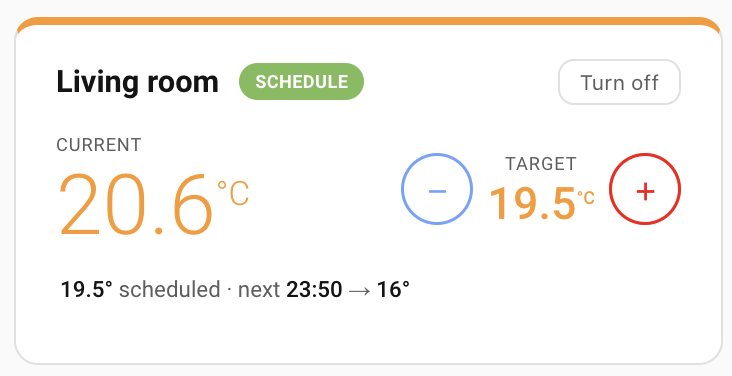
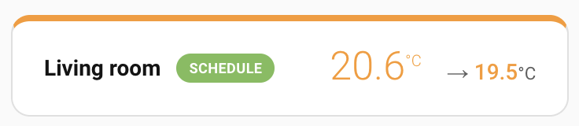
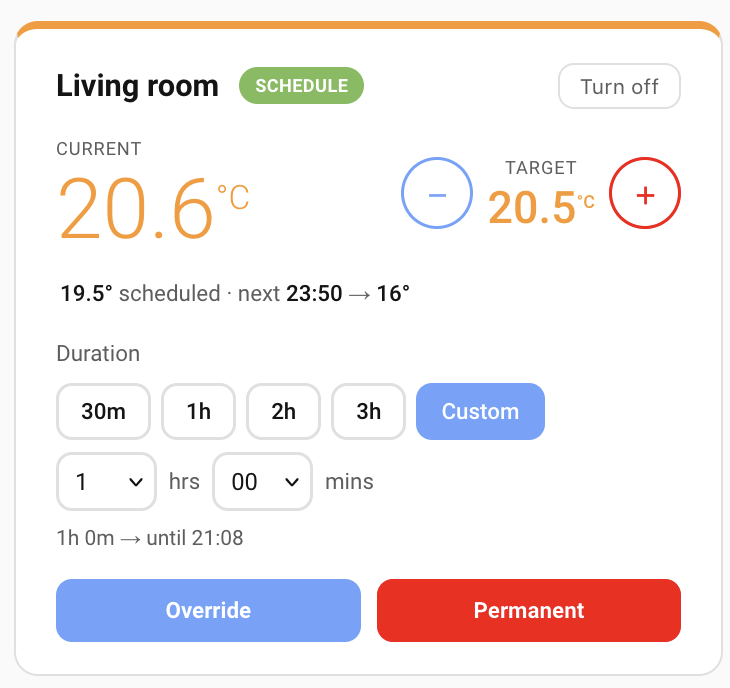
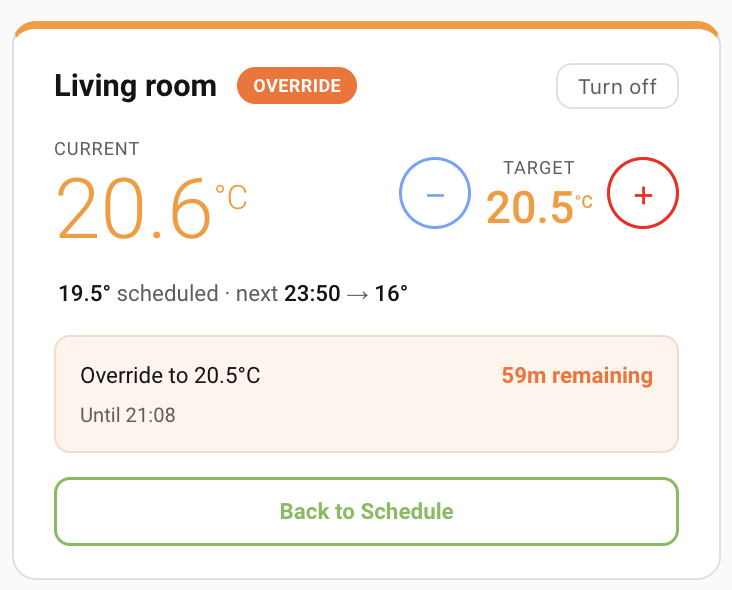
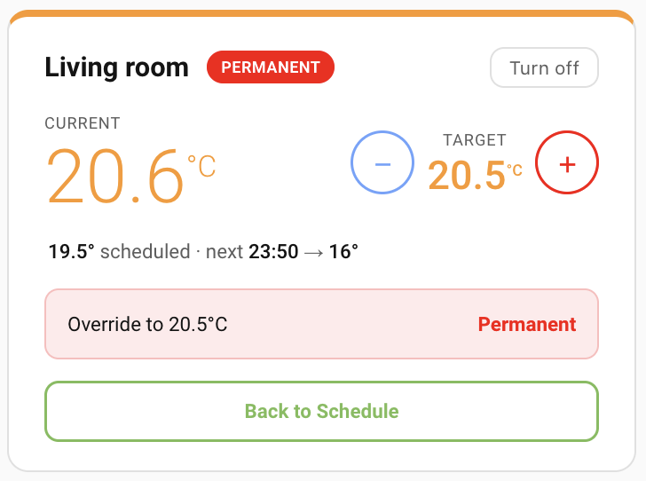

# Evohome Zone Card

Custom Lovelace card for Honeywell Evohome climate zones, with temporary/permanent override controls and optional compact mode.

## Features

- Live zone temperature and target display
- Temporary override with quick/custom durations
- Permanent override and return-to-schedule controls
- Optional HVAC on/off toggle
- Optional compact row layout
- Optional temperature color pills

[](https://my.home-assistant.io/redirect/hacs_repository/?owner=j0hnsmith&repository=evohome-zone-card&category=plugin)

## Screenshots

### Schedule



### Compact



### Override Options



### Temporary Override



### Permanent Override



## Installation

### HACS (Custom Repository)

1. In Home Assistant, open HACS.
2. Go to `⋮` -> `Custom repositories`.
3. Add this repository URL and select category `Dashboard`.
4. Install `Evohome Zone Card` from HACS.
5. Refresh browser cache after install.

### Manual

1. Copy `evohome-zone-card.js` to your Home Assistant `www` directory, for example:
   - `/config/www/evohome-zone-card.js`
2. Add it as a Lovelace resource:

```yaml
url: /local/evohome-zone-card.js
type: module
```

3. Add the card to a dashboard.

## Basic Card YAML

```yaml
type: custom:evohome-zone-card
entity: climate.living_room
```

## Full Config YAML Example

```yaml
type: custom:evohome-zone-card
entity: climate.living_room
name: Living Room
show_hvac_toggle: true
show_accent_bar: true
temp_pills: false
compact: false
```

## Config Options

| Option | Required | Type | Default | Description |
|---|---|---|---|---|
| `entity` | Yes | `string` | none | Evohome climate entity (for example `climate.living_room`) |
| `name` | No | `string` | entity friendly name | Overrides displayed room name |
| `show_hvac_toggle` | No | `boolean` | `true` | Shows the `Turn on` / `Turn off` button |
| `show_accent_bar` | No | `boolean` | `true` | Shows top accent bar color based on current temperature |
| `temp_pills` | No | `boolean` | `false` | Uses tinted pill backgrounds for current/target temperatures |
| `compact` | No | `boolean` | `false` | Starts in compact status-only view; expands on click |

## License

MIT. See [LICENSE](LICENSE).
